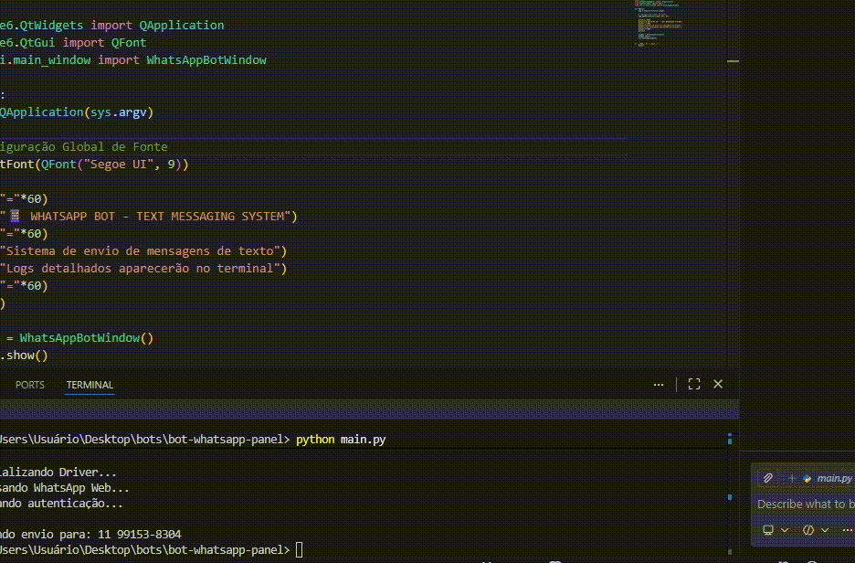

# 📱 WhatsApp Bot Pro (v2.0)


**WhatsApp Bot Pro** é uma ferramenta desktop de automação para envio massivo de mensagens. Desenvolvido em Python com arquitetura modular, utiliza **PySide6** para uma interface moderna em Dark Mode e **Selenium** para controlar o WhatsApp Web.

---



---

## 🚀 Funcionalidades Principais

* **🤖 Automação Web:** Controla o navegador para enviar mensagens automaticamente.
* **📱 Validação de Números:** Formata e verifica números antes do envio.
* **🛡️ Sistema Anti-Bloqueio:** Implementa delays de segurança (8s) entre mensagens.
* **📊 Relatórios em Tempo Real:** Métricas de sucesso, falhas e taxa de êxito na interface.
* **🎨 Interface Biohacker:** Design moderno, responsivo e com efeitos de brilho (Glow).
* **⚡ Arquitetura Modular:** Código limpo separado em Bot, UI e Threads.

---

## 🛠️ Stack Tecnológico

* **Linguagem:** Python 3.10+
* **Interface Gráfica (GUI):** PySide6 (Qt for Python)
* **Web Scraping:** Selenium WebDriver
* **Gerenciamento de Driver:** Webdriver-Manager

---

## 📂 Estrutura do Projeto

```text
WhatsAppBot/
│
├── main.py                 # 🚀 Ponto de entrada
├── requirements.txt        # Dependências
│
└── src/                    # Código Fonte
    ├── bot/                # 🧠 Lógica do Selenium
    │   └── whatsapp_bot.py
    │
    ├── ui/                 # 🎨 Interface Gráfica
    │   ├── main_window.py
    │   ├── widgets.py
    │   └── styles.py
    │
    ├── threads/            # ⚡ Execução em Background
    │   ├── connection_thread.py
    │   └── send_thread.py
    │
    └── utils/              # 🛠️ Utilitários
        └── helpers.py
```

## 🚀 Como Instalar e Executar

Siga este guia rápido para rodar o projeto na sua máquina:

### 1. Prepare o Ambiente
Certifique-se de ter o [Python 3.10+](https://www.python.org/downloads/) e o **Google Chrome** instalados (o bot utiliza o navegador oficial para automação).

### 2. Clone e Instale
Abra seu terminal (Git Bash, Powershell ou CMD) e rode:

```bash
# 1. Clone o repositório
git clone [https://github.com/joaocarpim/whatsapp-bot-pro.git](https://github.com/joaocarpim/whatsapp-bot-pro.git)

# 2. Entre na pasta
cd WhatsAppBot

# 3. Crie um ambiente virtual (Opcional, mas recomendado)
python -m venv venv

# No Windows ative com:
.\venv\Scripts\activate

# No Linux/Mac ative com:
source venv/bin/activate

# 4. Instale as dependências
pip install -r requirements.txt
```

## ▶️ Como Usar
Com o ambiente virtual ativado, execute o arquivo principal:

```bash
python main.py
```

### A interface abrirá. Siga os passos:

1. Clique no botão CONECTAR no canto superior esquerdo.

2. Um navegador abrirá. Leia o QR Code do WhatsApp Web com seu celular.

3. Aguarde o status na interface mudar para CONECTADO (Verde).

4. Digite sua Mensagem na caixa de texto central.

5. Cole a lista de Números (um por linha, ex: 11999999999) na caixa de alvos.

6. Clique em EXECUTAR e acompanhe o progresso no terminal lateral.

### ⚠️ Aviso Legal
#### Este software foi desenvolvido apenas para fins educacionais e de automação legítima (ex: comunicação com clientes que autorizaram o contato). O uso de bots para envio de SPAM ou mensagens não solicitadas viola os Termos de Serviço do WhatsApp e pode resultar no banimento permanente do número. Utilize com responsabilidade.

## 🤝 Contribuição

Contribuições são bem-vindas!

1. Faça um **Fork** do projeto.
2. Crie uma **Branch** para sua Feature:
```bash
   git checkout -b feat/IncrivelFeature
```
3. Faça o Commit:
```bash
git commit -m 'Add some IncrivelFeature'
```
4. Faça o Push:
```bash
git push origin feat/IncrivelFeature
```
5. Abra um Pull Request.

<p align="center">
Desenvolvido com 💙 por <a href="https://github.com/joaocarpim">joaocarpim</a>
</p>